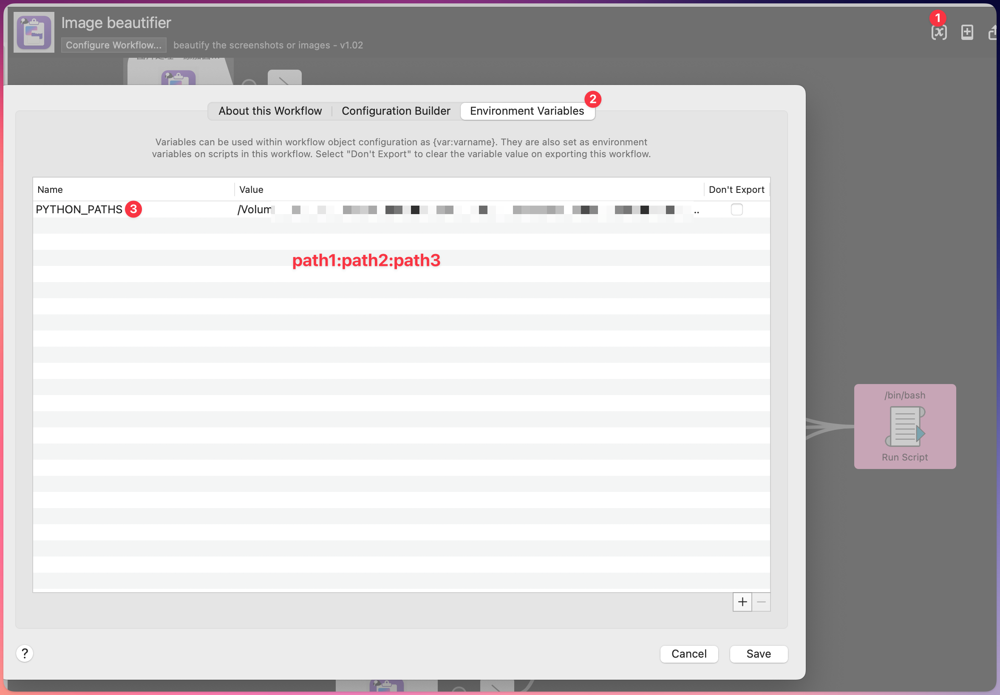

# Alfred Image Beautifier

这是一个Alfred workflow，用于美化剪贴板中的截图和图像。

Created by [zzkkyys](https://github.com/zzkkyys) | [Github](https://github.com/zzkkyys/Alfred-Image-Beautifier) 

## 1.1. 功能特性

### 1.1.1. 支持的图片处理方法

原图：

#### 1.1.1.1. 背景美化
为截图添加圆角和渐变背景，让图片更美观。

示例：

#### 1.1.1.2. 撕裂边缘效果
为图片添加撕裂边缘特效，适合做笔记或突出重点。

#### 1.1.1.3. 白色背景
将透明背景图片转换为白色背景，便于在浅色文档中使用。

#### 1.1.1.4. 组合效果
多种处理方法可叠加使用，效果更佳。

### 1.1.2. 输入方式

支持从剪贴板获取图像：
- 使用截图工具截图后自动复制到剪贴板
- 直接在`Finder`中复制图像文件到剪贴板

支持通过Alfred universal actions处理文件：
- 在`Finder`中选取一个或多个图像文件，使用Alfred universal action快捷键唤起窗口，搜索本workflow命令，进行处理

## 1.2. 使用方法

### 1.2.1. 设置环境变量

在Alfred的`Environment Variables`中添加以下变量：

- `PYTHON_PATHS`：Python可执行文件路径，多个路径用冒号分隔（例如：`/usr/local/bin/python3:/opt/homebrew/bin/python3`）

### 1.2.2. 运行Workflow

在Alfred打开Workflow，可以看到每个图片处理选项有各自的关键字，例如：`图片处理：添加圆角和背景色`，那么就可以在Alfred中输入该关键字来运行对应的图片处理功能：
1. 使用keyword搜索功能，输入关键字即可快速找到对应的处理选项，只能处理剪贴板中的图片
2. 使用universal actions功能，可以处理选中的文件

